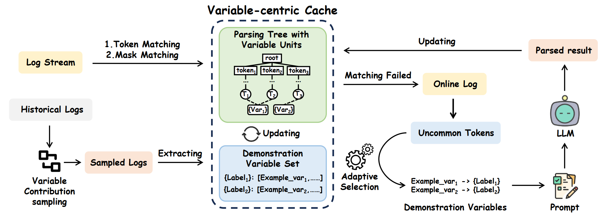

# Mining Variable Contributions for Efficient and Cost-Effective Log Parsing with LLMs




### Datasets

Please download the large-scale datasets of Loghub-2.0 via [Zenodo](https://zenodo.org/record/8275861) and unzip these datasets into the directory of `dataset`.

###  Installation

1. Install ```python >= 3.10```
2. ```pip install -r requirements.txt```


### Execution

- Candidate Sampling (optional)

    We have provided the saved sampled candidate logs for reproducing. You can also delete the file in `sample/` directory and execute the VISTA's sampling algorithm as follows:

    ```bash
    python sample.py
    ```

- Online Log Parsing

    Please first set your OpenAI API config in `config.json` in the following format.

    ```json
    {
        "api_key": "sk-xxxxxxxxxxxxxxxxxxxxxxxxxxxxxxxxx",
        "base_url": "https://xxxxxxxxxxxxxxxxxxxxxxxxxxx"
    }
    ```

    Then you can excute the following command to start online parsing.

    ```bash
    python main.py --data_type=full --shot=32 --model='MODEL_NAME'
    ```

    The parsed results will be saved in the `parsed/` directory and evaluation results will be saved in the `result/` directory.